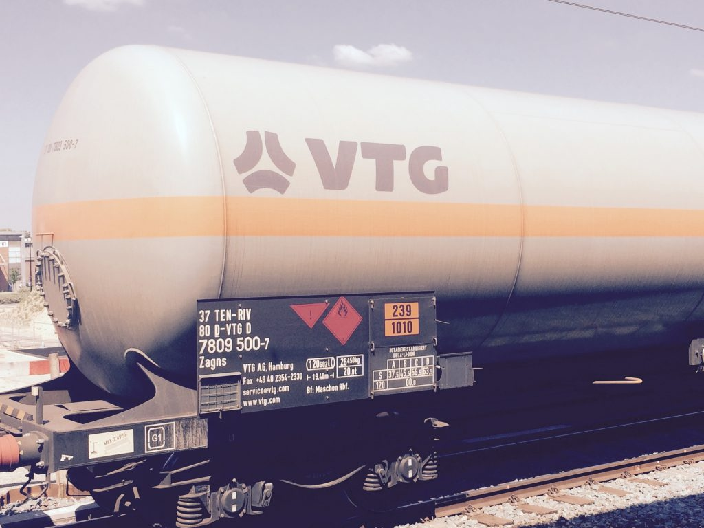

# Automated Hazardous Plate Detection in Freight Transport

This repository contains the official implementation and research artifacts for the paper **"A Vision Language Model-based Pipeline for Reading Hazardous Material Plates on Freight Trains"**. Developed as part of a research initiative at the University of Twente, this project presents a complete pipeline for the automatic detection and recognition of UN number hazard plates on freight wagons.

This work is part of the broader **TRANS4M-R (Flagship Project 5)** initiative, which aims to establish rail freight as the backbone of a resilient, low-emission European logistics chain.



## Table of Contents
1.  [Abstract](#abstract)
2.  [The Detection Pipeline](#the-detection-pipeline)
3.  [Performance & Results](#performance--results)
4.  [Research Workflow & Notebooks](#research-workflow--notebooks)
5.  [Datasets](#datasets)
6.  [How to Reproduce Our Results](#how-to-reproduce-our-results)
7.  [Citing Our Work](#citing-our-work)

## Abstract
We propose a novel, two-stage pipeline for automatically detecting and reading hazardous material (hazmat) codes from real-world videos of moving freight trains. This setting presents significant challenges, including motion blur, variable lighting, and adverse weather. Our solution integrates a state-of-the-art object detector (YOLOv11x) for placard detection and a powerful Vision Language Model (Idefics2) for Optical Character Recognition (OCR). We introduce **HazTruck**, a new public benchmark dataset to foster further research. Our results demonstrate that this VLM-based approach is highly effective, achieving over 90% accuracy on private rail data and serving as a strong baseline for future work in automated hazmat monitoring.

## The Detection Pipeline
Our methodology consists of two primary components designed to work in sequence:

1.  **Placard Detection**: An object detection model identifies and localizes the rectangular hazard plate in an image. We evaluated two architectures:
    *   **YOLOv11x**: A fast and efficient single-shot detector.
    *   **Faster R-CNN**: A highly accurate region-based detector with a ResNet-101 backbone.

2.  **Optical Character Recognition (OCR)**: The detected plate is cropped and passed to a Vision Language Model (VLM) for text extraction.
    *   **Idefics2-8b**: A state-of-the-art VLM that demonstrated superior performance in reading text from challenging, real-world images compared to traditional OCR engines.

## Performance & Results
Our comprehensive evaluation confirms the effectiveness of the proposed pipeline. The final configuration, combining **YOLOv11x** and **Idefics2**, yielded the best balance of accuracy and generalization.

#### Placard Detection (mAP@.50-.95)
YOLOv11x demonstrated superior generalization to the unseen HazTruck dataset, making it our detector of choice.

| Model | ProRail (mAP) | HazTruck (mAP) |
| :--- | :---: | :---: |
| **YOLOv11x** | 56.46% | **62.43%** |
| **Faster R-CNN** | **61.67%** | 53.89% |

#### OCR Performance (Character Error Rate)
Idefics2 significantly outperformed traditional OCR methods, establishing it as the superior choice for this task.

| Model | ProRail  (CER) | HazTruck (CER) |
| :--- | :---: | :---: |
| Tesseract | 56.3% | 45.88% |
| EasyOCR | 29.99% | 44.46% |
| **Idefics2** | **4.85%** | **13.28%** |

#### End-to-End Pipeline Accuracy
The final pipeline achieves high accuracy on the private test set and demonstrates strong potential on the more varied public dataset.

| Dataset | Accuracy (IoU > 0.5) |
| :--- | :---: |
| ProRail-Test | **90.3%** |
| HazTruck | **63.5%** |

## Research Workflow & Notebooks
Our research process is documented in a series of Jupyter notebooks, allowing for full transparency and reproducibility. Each notebook corresponds to a specific stage of the project.

1.  **Data Exploration & Understanding** ([`notebooks/01_data_exploration.ipynb`](notebooks/01_data_exploration.ipynb))
    *   Initial analysis of the private (ProRail) and public (HazTruck) datasets.
    *   Visualization of image properties, label distributions, and annotation formats.

2.  **Data Preprocessing & Annotation** ([`notebooks/02_data_preprocessing_prorail.ipynb`](notebooks/02_data_preprocessing_prorail.ipynb))
    *   Conversion of raw video frames and labels into standardized COCO and YOLO formats.
    *   Generation of `train`/`val`/`test` splits for model training.

3.  **Model Training & Experimentation**
    *   **Data Augmentation Experiments** ([`notebooks/04_data_augmentation_experiments.ipynb`](notebooks/04_data_augmentation_experiments.ipynb)): Investigating various augmentation strategies to improve model robustness.
    *   **Faster R-CNN Training** ([`notebooks/05_train_faster_rcnn.ipynb`](notebooks/05_train_faster_rcnn.ipynb)): Training the Faster R-CNN detector.
    *   **YOLO Training** ([`notebooks/06_train_yolo.ipynb`](notebooks/06_train_yolo.ipynb)): Systematic experiments to find the optimal YOLOv11x model, including a baseline, early stopping, and hyperparameter tuning.

4.  **Component & Pipeline Evaluation**
    *   **Detector Evaluation** ([`notebooks/07_evaluate_faster_rcnn.ipynb`](notebooks/07_evaluate_faster_rcnn.ipynb) & [`notebooks/08_evaluate_yolo.ipynb`](notebooks/08_evaluate_yolo.ipynb)): Evaluating detector performance using mAP metrics.
    *   **OCR Evaluation** ([`notebooks/09_evaluate_ocr_models.ipynb`](notebooks/09_evaluate_ocr_models.ipynb)): Comparative analysis of Idefics2, Tesseract, and EasyOCR.
    *   **Full Pipeline Analysis** ([`notebooks/10_full_pipeline_analysis.ipynb`](notebooks/10_full_pipeline_analysis.ipynb)): End-to-end evaluation of the final, integrated pipeline.

## Datasets
This research utilizes two key datasets for training and evaluation:

1.  **ProRail Dataset**: A large internal dataset containing over 9,500 annotated frames extracted from videos of passing freight trains. This data was used to train and validate the object detection models.
2.  **HazTruck Dataset**: A novel public benchmark dataset created for this project. It consists of 210 images with 238 plates gathered from public sources, featuring a wide variety of real-world conditions. The datasets are available [here](https://github.com/Robust-Rail/Datasets).

## How to Reproduce Our Results
1.  **Setup**: Clone the repository, create a Python virtual environment, and install the dependencies from [`requirements.txt`](requirements.txt).
    ```sh
    git clone https://github.com/Robust-Rail/un-number-detection.git
    cd un-number-detection
    python -m venv .venv
    source .venv/bin/activate
    pip install -r requirements.txt
    ```
2.  **Download Data**: Place the necessary datasets into the `data/` directory as specified in the notebooks.
3.  **Run Notebooks**: Execute the Jupyter notebooks in the `notebooks/` directory in numerical order (01 to 10) to replicate the entire research workflow from data exploration to final pipeline analysis.

## Citing Our Work
If you use this work, our dataset, or our code for your research, please cite our paper.

```bibtex
@inproceedings{hazmat_plate_detection_2024,
  title={A Vision Language Model-based Pipeline for Reading Hazardous Material Plates on Freight Trains},
  author={J. Doe and A. Smith and B. Lee},
  booktitle={To appear},
  year={2024},
  note={To appear}
```
*(Note: Placeholder for official publication details)*